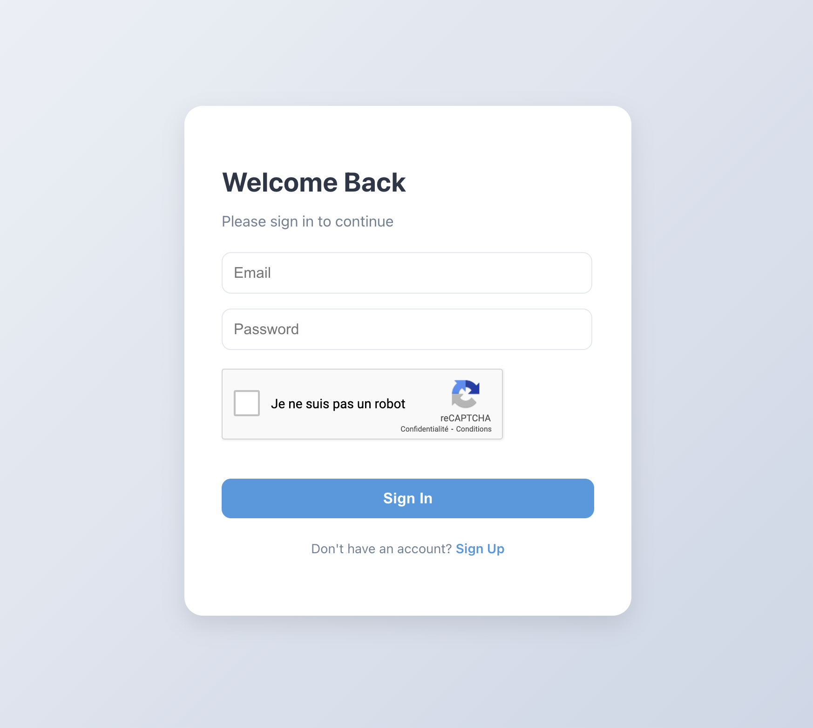
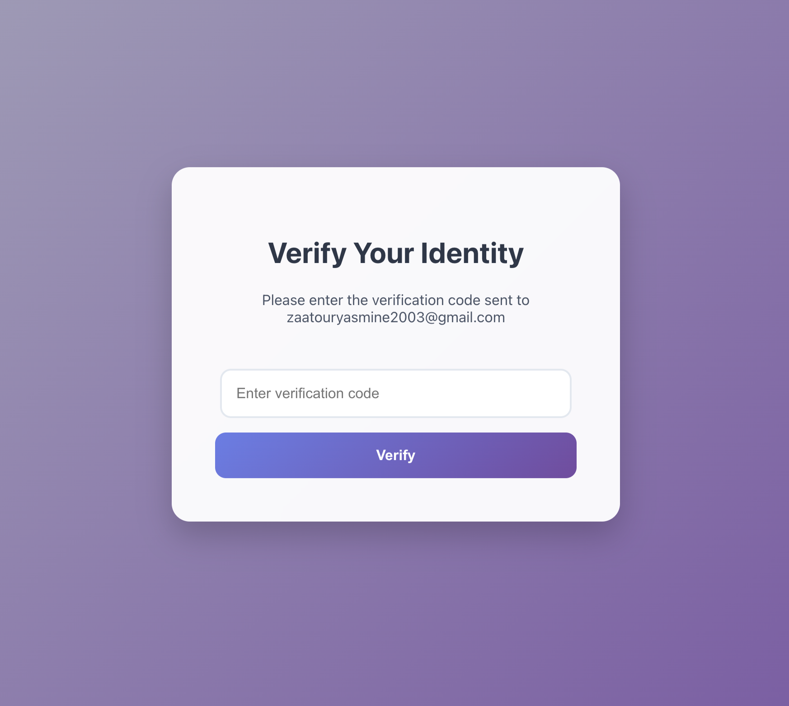
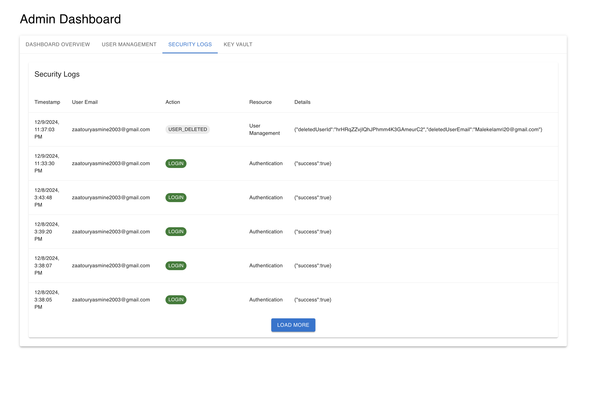

# SafeCrypt

SafeCrypt is a secure encryption and decryption web application that allows users to encrypt and decrypt messages using AES and Caesar Cipher algorithms. The application also includes an admin dashboard for managing users, viewing security logs, and accessing encrypted secrets.

## Features

- User authentication (sign up, sign in)
- AES-256 and Caesar Cipher encryption and decryption
- Admin dashboard for user management
- Security logs for tracking user activities
- Email verification for admin users (MFA)
- Encrypted secrets for storing sensitive information (Key Vault)
- Role based access control (Admin, User) and user status
- Recaptcha for preventing bots 

## Interfaces

### Sign In 


### Sign Up


### Email Verification for the admin 


### Admin Dashboard


### User Management


### Security Logs


### Encrypted Secrets


### Encryption and Decryption Interface


**Clone the repository:**

```sh
git clone https://github.com/your-username/safecrypt.git
cd safecrypt

npm install

Set up Firebase

Set up environment variables

